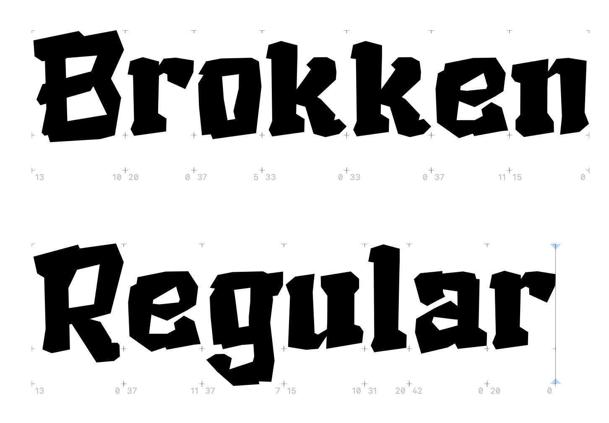
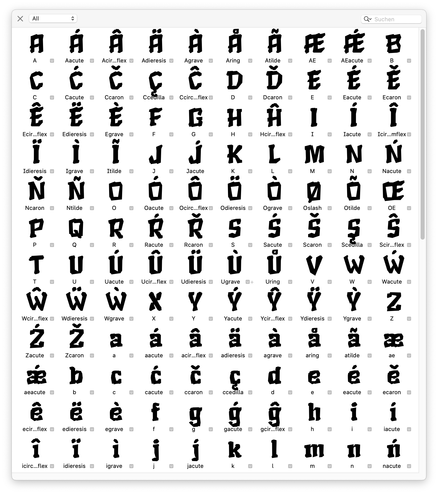

# brokken
 Creating a crossover between a broken brutalist and an 'esoteric'/fantasy font. You can find the current state as a usable `Brokken-Regular.otf`in the `otf` folder. The font is developed in Glyphs 3 and doesn't use any Bézier curves at all.

 

 ## Status Quo
 The font is in very early alpha state. Use at your own risk. I aim to support full Western Latin (including all diacritics and umlauts) but at the moment I focus on central Europe's letter bindings. A lot of testing is neccessary. 

## Known Issues
- I can't test if the Dutch íj/ÍJ ligature works properly
- Spacing and Kerning is rudimentary at best
- The font is currently tested on OS X only, therefore I don't know if the automatic hinting works on Windows or Linux
- Critical: The horizontal scaling of the letters/glyphs needs to be adjusted, the font is too tall at the moment
- I can't estimate if the shapes of the Icelandic letters (such as Þ, þ or ð) are recognizable for native speakers/readers since I don't know the language
- the number glyphs need some rework/finetuning
- all punctuations need some testing
