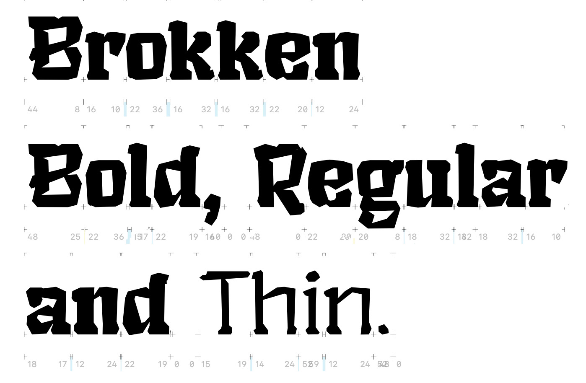
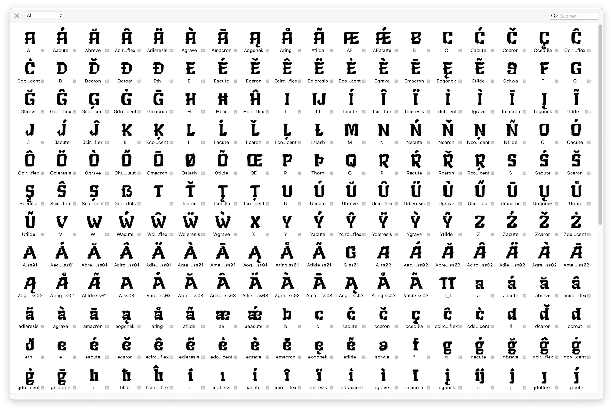
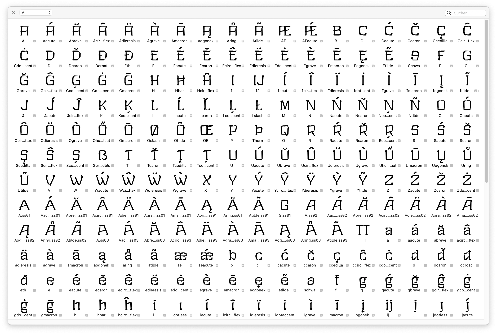
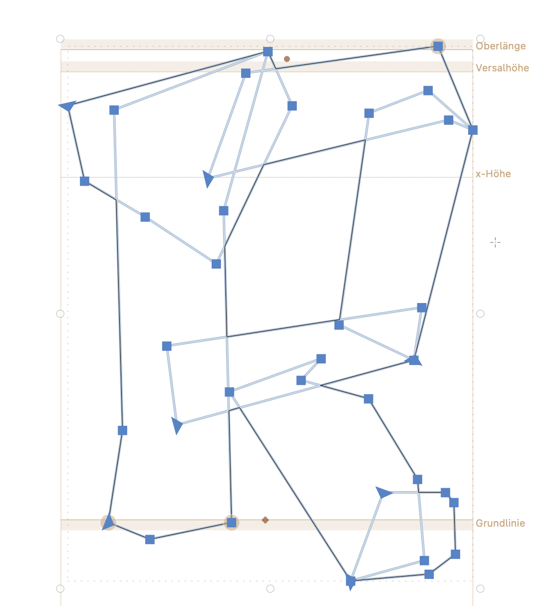

# BROKKEN
 Creating a crossover between a broken brutalist and an ‘esoteric’/fantasy font. You can find the current state (untested) as a usable `Brokken.otf` (OS X) and `Brokken.ttf` (WIN) in the `fonts` folder. If you want to use the font in a semi-tested version please use one of the [stable releases](https://github.com/eisensafran/brokken/releases).
 _Brokken_ is developed in Glyphs 3 and doesn't use any Bézier curves at all. More info about its design and features can be found [here](https://andi-siess.de/brokken/).

 

 ## Status Quo
 - The font is in an early beta state. **Use at your own risk.** All central European letters (including all diacritics) are supported. A lot of testing is still neccessary. 
 - The *bold*, *semibold*, *regular*, *light*, and *thin* versions can be considered usable, an *italic* version is in development (currently untested builds can be found in `fonts`)
- The font features two masters (*Brokken bold* and *Brokken thin*) where the other versions (*Brokken light*, *Brokken regular* and *Brokken semibold*) are interpolated from.
- Currently there are 412 glyphs in each master, that feature a total of 549 (master *bold*) + 663 (master *thin*) kerning pairs (excluding group kerning).




## Known Issues & Open Questions
- ~~I can't test if the Dutch ij/IJ ligature works properly since I don't know the language.~~ **UPDATE:** Thanks to Henrike I understood the problem a lot better: The key issue here is that a `íj́` is difficult to input on a standard keyboard, therefore it is neccessary that once a `í` following a `j` is detected the `j` needs to be replaced by `j́`. This is also true for captial letters. ([see here](https://nl.wikipedia.org/wiki/IJ_(digraaf))). Although I think I followed all recommendations from [here](https://glyphsapp.com/learn/localize-your-font-accented-dutch-ij) there is still an error report once I run `fontbakery check-googlefonts`. 
    ```
    Language          FAIL messages
    ━━━━━━━━━━━━━━━━━━━━━━━━━━━━━━━━━━━━━━━━━━━━━━━━━━━━━━━━━━━━━
    nl_Latn (Dutch)   Shaper didn't attach acutecomb to uni0237
    ^                 Shaper didn't attach acutecomb to J
    ```
    
    This error does not occur when the font is exported by the Glyphsapp export function. Although a total different error appears: 

    > FAIL The following glyphs have components which themselves are component glyphs: * uni01F4 * Gcircumflex * uni004A0301 * Jcircumflex * Ubreve * Aacute.ss01 * Abreve.ss01 * Acircumflex.ss01 * Adieresis.ss01 * Agrave.ss01 and 29 more.

    I have a subtle suspicion that these errors appear due to my somewhat convoluted setup: the `component` characters (such as `acutecomb`) consist of components on its own. Maybe there is a mismatch with this configuration. After testing I can confirm this -- when converting the components within the `acutecomb` glyph into paths the font happily passes the Dutch language check in `fontbakery`. It is strange that this error does not occur with any other comb-characters. **UPDATE**: Issue seems to be resolved.
- Spacing and kerning is rudimentary at best, but it is in constant development.
- Certain group kerning features apparently do not work under Windows – I can't figure out why. (Example string: `können`)
- The font is primarily tested on OS X, therefore I don't know if the automatic hinting works 'good enough' for all letter combinations on Windows or Linux. I mitigated some issues by adding more sidebearing (+5 on each side) for each glyph in the `thin`-master.
- ~~Critical: The horizontal scaling of the letters/glyphs needs to be adjusted, the font is too tall at the moment~~ ~~**UPDATE:** Did some rescaling, metrics still need to be adjusted since the descenders are now cut off.~~ **UPDATE 2:** Metrics seem to be OK for now (tested with OS X and Windows 10). **TODO:** Metrics need to be adjusted to comply with [this](https://googlefonts.github.io/gf-guide/metrics.html).
- I can't estimate if the shapes of the Icelandic letters (such as Þ, þ or ð) are recognizable for native speakers/readers since I don't know the language
- the number glyphs need some rework/finetuning
- all punctuations need some testing
- the ogonek diacritic instance uses currently the `bottom`-anchor point, not the `ogonek`-anchor point
- ~~the `lcaron`, `dcaron`, `Lcaron` and `Dcaron` are composed from the standard `caroncomb`-component, but need their own `caroncomb.alt`-component instead, otherwise the shape of the characters are wrong/off. See [here](https://forum.glyphsapp.com/t/lcaron-caron-or-apostrophe/6131).~~
- ~~missing characters for Catalan (therefore failing the `GF_Latin_Core`-test by fontbakery)~~

## Useful Commands
- The builds are created using `fontmake` (`fontmake -i -g ../sources/brokken.glyphs -a`) which needs to be run inside the `fonts` directory. (The argument `-i` is given in order to interpolate between the masters, otherwise only the `thin` and `bold` masters are exported to `ttf`/`otf`. The argument `-a` is given to apply basic autohinting to the `ttf` version.)  See [here](https://github.com/googlefonts/fontmake). 
- activate Python3 virtual environment: `source myenv/bin/activate`
- run QA-tool fontbakery with Google Fonts template: `fontbakery check-googlefonts Brokken-Bold.ttf --full-lists` (reports can be found in the `reports` directory).
- building the `*.ttf` font files with `fontmake` and applied autohinting will result in an error message from `fontbakery`: 

    > FAIL This is a hinted font, so it must have bit 3 set on the flags of the head table, so that PPEM values will becrounded into an integer value.  
    
    As far as I can see this flag can **not** be set inside Glyphsapp (see [here](https://forum.glyphsapp.com/t/font-bakery-hinting-error-message-bit-3-of-head-table/16210/6) and [here](https://groups.google.com/g/googlefonts-discuss/c/VIqqGTjtr5M?pli=1)). Therefore it seems necessary that this issue needs to be adressed by running `gftools fix-hinting` on each generated `ttf`. Useful `bash`-scripts can be found [here](https://forum.glyphsapp.com/t/font-bakery-hinting-error-message-bit-3-of-head-table/16210/6). To streamline this process I condensed the whole building and testing process into one bash script:

    ```
    #!/bin/bash

    # initialize python3 virtual environment
    source myenv/bin/activate

    # clean the export folder
    echo "deleting all contents of fonts folder"
    rm -rf $HOME/Documents/GitHub/brokken/fonts/*

    # build the font using fontmake
    echo "building font with fontmake"
    cd $HOME/Documents/GitHub/brokken/fonts
    fontmake -i -g ../sources/brokken.glyphs -a

    # correct ttf version with gftools
    echo "gftools"
    cd $HOME/Documents/GitHub/brokken/fonts/autohinted/instance_ttf
    for font in *.ttf
    do
        gftools fix-hinting $font;
        if [ -f "$font.fix" ]; then mv "$font.fix" $font; fi
    done

    # check font with fontbakery
    echo "checking font with fontbakery"
    fontbakery check-googlefonts Brokken-Bold.ttf --full-lists

    # cleanup
    echo "moving autohinted contents to default instance_ttf folder"
    mkdir -p $HOME/Documents/GitHub/brokken/fonts/instance_ttf
    cp -r $HOME/Documents/GitHub/brokken/fonts/autohinted/instance_ttf/*.ttf $HOME/Documents/GitHub/brokken/fonts/instance_ttf
    rm -rf $HOME/Documents/GitHub/brokken/fonts/autohinted

    echo "renaming instance_ttf and instance_otf to ttf and otf"
    mv $HOME/Documents/GitHub/brokken/fonts/instance_ttf $HOME/Documents/GitHub/brokken/fonts/ttf 
    mv $HOME/Documents/GitHub/brokken/fonts/instance_otf $HOME/Documents/GitHub/brokken/fonts/otf 

    # make a copy of the otf files in the document directory for testing in InDesign
    echo "copying the contents of otf folder to the InDesign test folder"
    cp -r $HOME/Documents/GitHub/brokken/fonts/otf/*.otf $HOME/Documents/GitHub/brokken/test/"brokken-test Ordner"/"Document fonts"
    ```


## Design/Approach
The font attempts a hybrid between a brutalist aesthetic, at times reminiscent of a *Textura*, and a design that evokes the aesthetics of 1980s pen-and-paper role-playing games and fantasy novels. As a ‘creative constraint’, the font does not use any Bézier curves. The name ‘Brokken’ is derived from its rock-like appearance (German ‘Brocken’ = chunk, bolder), the approach that all letters are created by combining chunks, and that the overall design is strongly influenced by ‘broken’ typography (such as *Textura*, *Element*, etc.).


Note: Screenshot shows an old version of the capital R.
