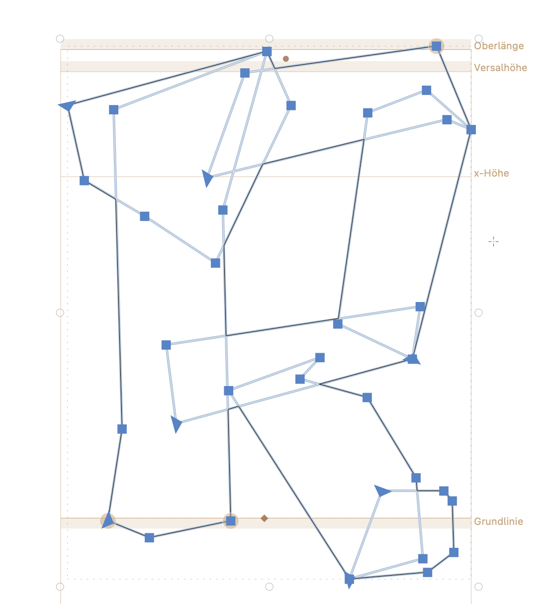

# BROKKEN
 Creating a crossover between a broken brutalist and an 'esoteric'/fantasy font. You can find the current state (untested) as a usable `Brokken-Bold.otf` (OS X) and `Brokken-Bold.ttf` (WIN) in the `builds` folder. If you want to use the font in a semi-tested version please use one of the [stable releases](https://github.com/eisensafran/brokken/releases).
 _Brokken_ is developed in Glyphs 3 and doesn't use any Bézier curves at all. More info about design and features can be found [here](https://andi-siess.de/brokken/).

 

 ## Status Quo
 The font is in a very early alpha state. Use at your own risk. I aim to support full Western Latin (including all diacritics and umlauts) but at the moment I focus on central Europe's letter bindings. A lot of testing is neccessary. 

## Known Issues
- I can't test if the Dutch íj/ÍJ ligature works properly
- Spacing and Kerning is rudimentary at best
- The font is currently tested on OS X only, therefore I don't know if the automatic hinting works 'good enough' on Windows or Linux
- ~~Critical: The horizontal scaling of the letters/glyphs needs to be adjusted, the font is too tall at the moment~~ (UPDATE: Did some rescaling, metrics need to be adjusted.)
- I can't estimate if the shapes of the Icelandic letters (such as Þ, þ or ð) are recognizable for native speakers/readers since I don't know the language
- the number glyphs need some rework/finetuning
- all punctuations need some testing

## Design/Approach
The font attempts a hybrid between a brutalist aesthetic, at times reminiscent of a Textura, and a design that evokes the aesthetics of 1980s pen-and-paper role-playing games and fantasy novels. As a "creative constraint," the font does not use any Bézier curves. The name "Brokken" is derived from its rock-like appearance (German "Brocken" = chunk, bolder) and the approach that all letters are created by combining chunks.

