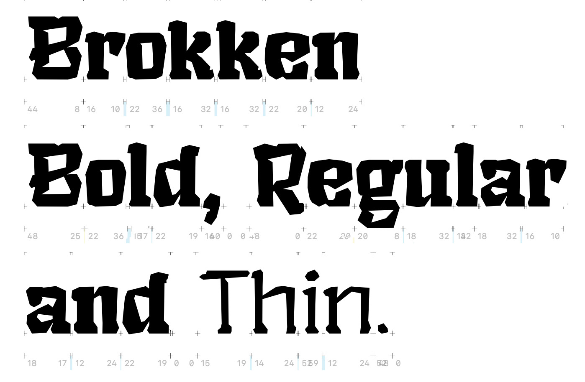
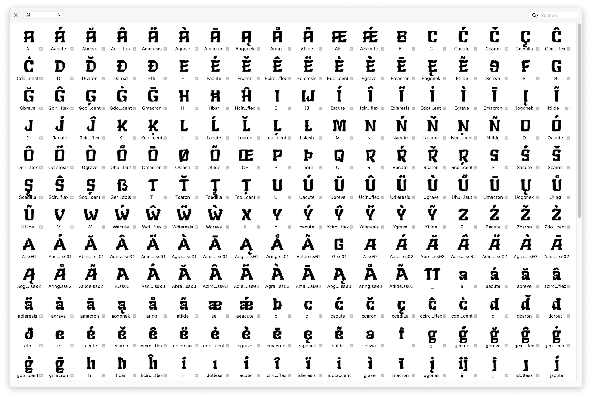

# BROKKEN
 Creating a crossover between a broken brutalist and an ‘esoteric’/fantasy font. You can find the current state (untested) as a usable `Brokken.otf` (OS X) and `Brokken.ttf` (WIN) in the `builds` folder. If you want to use the font in a semi-tested version please use one of the [stable releases](https://github.com/eisensafran/brokken/releases).
 _Brokken_ is developed in Glyphs 3 and doesn't use any Bézier curves at all. More info about its design and features can be found [here](https://andi-siess.de/brokken/).

 

 ## Status Quo
 - The font is in an early beta state. **Use at your own risk.** All central European letters (including all diacritics) are supported. A lot of testing is neccessary. 
 - The *bold*, *semibold*, *regular*, *light*, and *thin* versions can be considered usable, an italic version is in development (currently only untested builds can be found in `builds`)
- The font features two masters (*Brokken bold* and *Brokken thin*) where the other versions (*Brokken light*, *Brokken regular* and *Brokken semibold*) are interpolated from.
- Currently there are 387 glyphs in each master, that feature a total of 268 (master *bold*) + 263 (master *thin*) kerning pairs (excluding group kerning).

## Known Issues & Open Questions
- ~~I can't test if the Dutch ij/IJ ligature works properly since I don't know the language.~~ **UPDATE:** Thanks to Henrike I understood the problem a lot better: The key issue here is that a `íj́` is difficult to input on a standard keyboard, therefore it is neccessary that once a `í` following a `j` is detected the `j` needs to be replaced by `j́`. This is also true for captial letters. ([see here](https://nl.wikipedia.org/wiki/IJ_(digraaf)))
- Spacing and kerning is rudimentary at best, but it is in constant development.
- Certain group kerning features apparently do not work under Windows – I can't figure out why. (Example string: `können`)
- The font is primarily tested on OS X, therefore I don't know if the automatic hinting works 'good enough' on Windows or Linux
- ~~Critical: The horizontal scaling of the letters/glyphs needs to be adjusted, the font is too tall at the moment~~ ~~**UPDATE:** Did some rescaling, metrics still need to be adjusted since the descenders are now cut off.~~ **UPDATE 2:** Metrics seem to be OK for now (tested with OS X and Windows 10).
- I can't estimate if the shapes of the Icelandic letters (such as Þ, þ or ð) are recognizable for native speakers/readers since I don't know the language
- the number glyphs need some rework/finetuning
- all punctuations need some testing

## Design/Approach
The font attempts a hybrid between a brutalist aesthetic, at times reminiscent of a *Textura*, and a design that evokes the aesthetics of 1980s pen-and-paper role-playing games and fantasy novels. As a ‘creative constraint’, the font does not use any Bézier curves. The name ‘Brokken’ is derived from its rock-like appearance (German ‘Brocken’ = chunk, bolder), the approach that all letters are created by combining chunks, and that the overall design is strongly influenced by ‘broken’ typography (such as *Textura*, *Element*, etc.).

Note: Screenshot shows an old version of the capital R.
